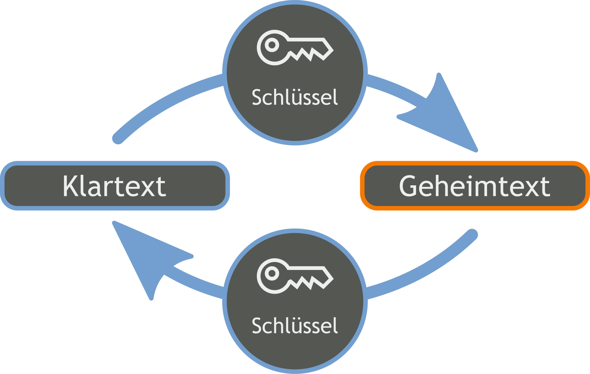
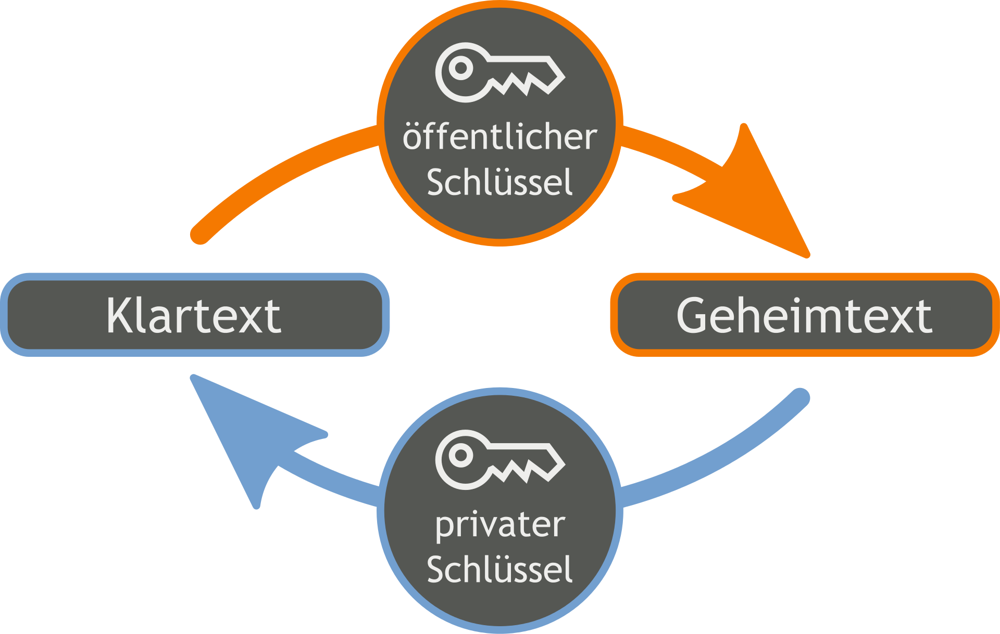
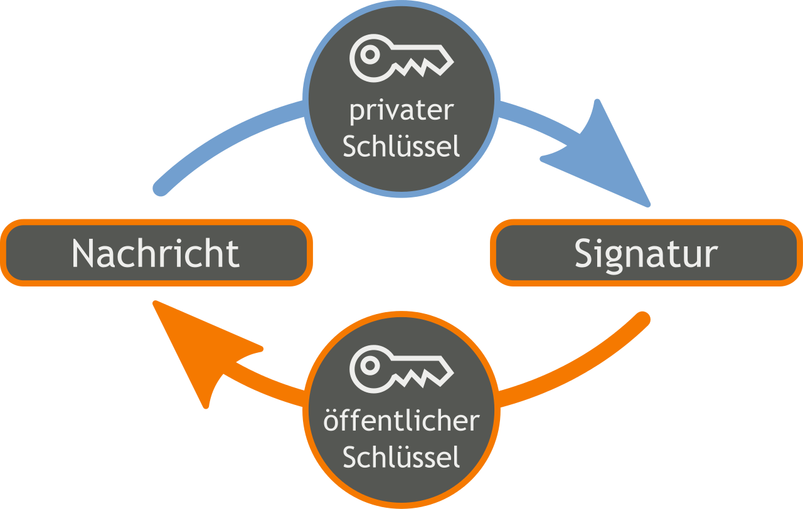

= Verschlüsselung

== _Anforderungen an eine sichere Kommunikation_

** Authenticity (Authenzität) 
*** Sender der Nachricht ist eindeutig identifizierbar

** Integrity (Unverfälschtheit)
*** Nachricht wurde nicht verfälscht

** Confidentiality (Vertrauligkeit)
*** Nachricht ist vor Zugriff durch Dritte geschützt

** Commitment (Verbindlichkeit)
*** Die Urheberschaft einer Nachricht kann nicht abgestritten werden 

== _Symetrische Verschlüsselung_

Symmetrische Verschlüsselung. Bei symmetrischen Verschlüsselungsverfahren gibt es im Gegensatz zu den asymmetrischen Verfahren, nur einen einzigen Schlüssel. Dieser Schlüssel ist für die Verschlüsselung, als auch für die Entschlüsselung zuständig.

-> _einige symetrische Algorithmen:_
... DES
... AES
... IDEA
... CAST

== _Asymetrische Verschlüsselung_

Asymetrische Verschlüsselung. Beim asymetrischen Verschlüsselungsverfahren gibt es zwei Arten von Schlüsseln. Einen privaten Schlüssel und einen öffentlichen Schlüssel. Ein Schlüssel wird für die Verschlüsselung und ein Schlüssel wird für die Entschlüsselung verwendet.

-> _einige asymetrische Algorithmen:_
... Diffie-Hellmann
... DAS/DSS
... RSA
... ECC

== _Digitales Zertifikat_

Ein digitales Zertifikat ist ein digitaler Datensatz, meist nach Standards der ITU-T oder der IETF, der bestimmte Eigenschaften von Personen oder Objekten bestätigt und dessen Authentizität und Integrität durch kryptografische Verfahren geprüft werden kann. Das digitale Zertifikat enthält insbesondere die zu seiner Prüfung erforderlichen Daten. Die Ausstellung des Zertifikats erfolgt durch eine offizielle Zertifizierungsstelle, die Certification Authority (CA). 

== _Schlüssel erzeugen nach Diffie Hellmann_

** gemeinsame, öffentliche, möglichstgroße Primzahl (p)

** gemeinsame, öffentliche zufällige Zahl (z)

** Jeder Kommunikationspartner wählt eine persönliche geheime Zahl Alice wählt (a) und Bob wählt (b)

** Beide berechnen nun die Potenz von (z) und Ihrer eigenen geheimen Zahl mit anschließender Division. Alice rechnet A=z^a mod p, Bob rechnet B=z^b mod p

** Alice und Bob tauschen A und B aus (öffentlich bekannt sind jetzt A, B, p, z)

** Beide führen die Rechnung jetzt mit der jeweils anderen Zahl durch
Alice rechnet _A=B^a mod p, Bob rechnet _B=A^b mod p

** Beide erhalten jetzt die gleiche nur Ihnen bekannte geheime Zahl

== _Beispiel Rechnung nach Diffie-Hellmann_

** Primzahl p = 13
** Zufallszahl z = 3
** Alice a = 4
** Bob b = 5
** Alice rechnet: 81 mod p 13 = 3 (Also 3*3*3*3 sind 81, 81 : 13 sind 6 Rest 3)
** Bob rechnet: 243 mod p 13 = 9 ( Also 3*3*3*3*3 sind 243, 243 : 13 sind 18 Rest 9)
** Nun rechnen beide mit dem Ergebnis des Anderen
** Alice rechnet: 6561 mod p 13 = 9 (Also 9*9*9*9 sind 6561 : 13 sind 504 Rest 9)
** Bob rechnet: 243 mod p 13 = 9 (also 3*3*3*3*3 sind 243, 243 :13 sind Rest 9)
** Der Rest von 9 ist der gemeinsame Schlüssel. +

== _Schlüssel unter Linux erzeugen_

[source,bash]
.Befehl um ein RSA2048 ssh Schlüsselpaar zu erzeugen
----
ssh keygen -t rsa -b 2048
----

[source,bash]
.Befehl um meinen öffentlichen Schlüssel mit dem Anderen zu teilen
----
ssh-copy-id tn@172.24.0.174
----

[source,bash]
.Um ein Alias anzulegen, muss der Alias in die Datei .bashrc eingetragen werden. Hierzu die Datei .bashrc mit VIM öffnen
----
vi .bashrc
----

